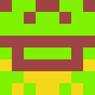

# Blockies Vue

Implementation of the [EthereumBlockies](https://github.com/ethereum/blockies) on Vue.js.

Depending on where you're using the original blockies on vue or other project I was getting some errors so I just gave up and turned it entirely into a vue code.

Blockies
========

_ contain strips from the original readme of the project_

A tiny library for generating identicons for Ethereum addresses. These are not meant to replace user profiles, but as security icons, to allow the user to more easily check if an address he wants to interact with is the correct one. The symmetrical aspect of the icons allow our brain see [faces or objects](https://en.wikipedia.org/wiki/Pareidolia), making the icon more recognizable. This also contains the HQX library, for optionally creating not-so-blocky icons (see sample below).




Check an example here [./example/example.vue](https://github.com/afa7789/BlockiesVue/blob/master/example/example.vue)

[**Demo page**](http://download13.github.io/blockies/)

Use
-----

This only works with this package [github.com/alexvandesande/blockies](github.com/alexvandesande/blockies).

```js
var icon = blockies.create({ // All options are optional
    seed: 'randstring', // seed used to generate icon data, default: random
    color: '#dfe', // to manually specify the icon color, default: random
    bgcolor: '#aaa', // choose a different background color, default: random
    size: 15, // width/height of the icon in blocks, default: 8
    scale: 3, // width/height of each block in pixels, default: 4
    spotcolor: '#000' // each pixel has a 13% chance of being of a third color, 
    // default: random. Set to -1 to disable it. These "spots" create structures
    // that look like eyes, mouths and noses. 
});
 
document.body.appendChild(icon); // icon is a canvas element
```

## Usage

```ts
    import Blockies from 'blockies-vue'
    // Without Props
    <Blockies />
    // With Props
    <Blockies
        :seed= 'randstring', // seed used to generate icon data, default: random
        :color= '#dfe', // to manually specify the icon color, default: random
        :bgcolor= '#aaa', // choose a different background color, default: random
        :size= 15, // width/height of the icon in blocks, default: 8
        :scale= 3, // width/height of each block in pixels, default: 4
        :spotcolor= '#000' // each pixel has a 13% chance of being of a third color,
    />
```


Notes
-----

The defaults of size 8 and scale 4 generate 32x32 pixel icons. Below are some standard sizes that work well. A size larger than 10 will start generating more noisy icons that don't ressemble much.

 * 24x24 `{size: 8, scale: 3}`
 * 50x50 `{size: 5, scale: 10}`

Build
-----

node build
All this does is minify `blockies.js` to `blockies.min.js`.

License
-------

[WTFPL](http://www.wtfpl.net/)


Special thanks to Alex Van de Sande for showing me blockies.


